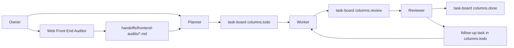

# Workflow Overview

This is a simple, JSON-backed task board for coordinating multiple AI agents on one project. It has a three-role board core, **Planner**, **Worker**, and **Reviewer**, plus optional upstream handoff roles such as **Web Front-End Auditor**. It works with both the Claude and Codex CLIs.

> This is the generic three-role core. Projects can extend it (see "Extending the workflow" at the end), but start here.

## Source of Truth

The task board JSON is the source of truth:

- `task-board/board.json`

The visual board is a read-only display of that JSON for the owner:

- `task-board/viewer.html`

Agents do not read, parse, or update the HTML viewer during normal workflow. They coordinate by updating `board.json` (directly, or through the API when the backend is running).

When the local task-board backend is running, agents should use its API for card creation, edits, and status changes:

- `workflow/api-guide.md`

Every agent that talks to the task board API registers at the start of the chat by calling `POST /api/register-agent` with `personalName`, `model` (`claude` or `codex`), and `role`. The server returns an `agentId` (for example `agt_a1b2c3`). Send that `agentId` in every later API payload — it is the contract key. `personalName` is a short lowercase token (pick the first unused name from `task-board/agent-color-schema.json#personalNamePool`, or use the one the owner or the Spawn button gave you). The backend records the resolved display name in `lastApiActor`, each task's `apiHistory`, and the board-level `apiAuditLog`. The HTML viewer renders each agent as a colored chip: the model determines the background color (orange for Claude, blue for Codex) and the role determines the border color.

The backend writes an append-only API audit log at `task-board/task-board-api.log` (JSON Lines: request time, method, endpoint, task ID, agent name, status, error). The viewer uses separate `/viewer/...` endpoints and writes to `task-board/task-board-viewer.log`, so viewer activity does not mix with agent activity. These logs are for troubleshooting only; the source of truth remains `board.json`.

The viewer's Spawn buttons launch Worker and Reviewer agents as hidden non-interactive CLI processes (they do not open terminal tabs). Each spawned process receives the current `backendBaseUrl` and writes output to `task-board/spawned-agent-logs/`. The backend exposes spawned processes through `GET /api/agents` with PID-backed status (`running`, `exited`, `pid-reused`, or `unknown`) and latest log previews. The viewer also has optional auto-dispatch controls per role (selected model, max active agents, Auto toggle) and CLI command settings stored in `task-board/agent-dispatch-settings.json`; when Auto is on, the backend spawns hidden agents only when matching work exists and active + still-running pending agents are below that role's maximum. Use the viewer Settings health checks on a new laptop before spawning: they call `/viewer/agent-health-check` with the same command shape as real hidden agents and report actionable setup steps. If that route returns 404, restart `task-board/server.py` so the running backend has the current health-check routes.

## Global Pause and Resume

The backend supports a board-wide pause for rate-limit windows and other owner-directed stops. Pause state lives in `task-board/agent-dispatch-settings.json` under `pause` (`pausedUntil`, `pausedBy`, `pausedAt`, `pauseReason`). `GET /api/pause-status` or `GET /api/pause` returns the active status with `isPaused`, `remainingSeconds`, `remainingText`, and the pause metadata. The viewer uses the `/viewer/...` equivalents.

`POST /api/pause-plus-one-hour` and its alias `POST /api/pause` add exactly one hour per call. The backend calculates the next `pausedUntil` from `max(now, current pausedUntil) + 1 hour`, so repeated Pause +1h clicks accumulate time instead of resetting the window. `POST /api/resume-now` clears the active pause immediately.

While paused, the backend rejects new Worker claims, Reviewer claims, and backend spawns: `POST /api/claim-task`, `POST /api/claim-review`, and `POST /api/spawn-agent` return HTTP `423` with `paused: true`, `pausedUntil`, `remainingSeconds`, `remainingText`, and `pauseReason`. The viewer Spawn button uses the same spawn path, so manual viewer spawns and auto-dispatch spawns are both blocked. This is server enforcement; role instructions are secondary guidance. The pause does not kill already-running agents or prevent a current claimed task from moving forward, but new claims and new backend spawns stay blocked until the pause expires or is resumed.

Auto-dispatch checks pause state before doing work. When the board is paused it may clean stale pending-spawn records, but it does not spawn new agents and it does not resume paused runs. After the pause expires or `Resume now` clears it, auto-dispatch resumes eligible `pausedRuns` before normal new Worker/Reviewer spawning.

`POST /api/hard-stop-spawned-agents` and its alias `POST /api/hard-stop` require an active pause and target only backend-spawned hidden Worker/Reviewer processes recorded in `pendingSpawns`. An optional `role` can limit the stop to `worker` or `review`. Hard stop does not kill manual terminal/chat agents, does not review work, and does not unclaim tasks. For each stopped process, the backend records a `pausedRuns` entry with the role, model, personal name, previous process ID, prior log path, stop status, inferred `currentTaskId`/board column when available, and resume state.

There is no separate checkpoint endpoint. The resume checkpoint is the board plus active-agent state: task claims/review claims in `board.json`, `/api/register-agent`, `/api/heartbeat-agent` with `currentTaskId`, pending-spawn metadata, and the prior spawned-agent log. Logs are context only. The task board remains the source of truth.

When auto-dispatch resumes a paused run, it starts the same role/model/personal name with `resumeMode is paused-run`, `previousProcessId`, `priorLogPath`, `stoppedAt`, `currentTaskId`, `currentBoardColumn`, and `currentTaskStillLockedByYou` in the start phrase. A resumed Worker or Reviewer must inspect the board through the API and inspect the worktree before editing. If the current task is still locked by that same personal name, the agent continues that task before claiming anything new. If the task is missing, unlocked, unknown, or owned by someone else, the agent reconciles from the board and prior log, then either continues the safest matching locked task or unregisters with a clear note.

Every task must have a real, nonblank title. `Untitled`, `Untitled task`, and blank titles are invalid; the API rejects them and the viewer hides malformed records.

When a task depends on an image, the Planner or Reviewer saves the reference under `reference-images/` and records it in the task's `referenceImages` array (`path`, `description`, `source`). Workers inspect those paths before implementing.

## Workflow Graph

The Web Front-End Auditor is read-only with respect to the task board. It writes a Markdown handoff for Planner, and Planner decides which findings become deduplicated `todo` tasks.

### Human-input agents and the Planner chat

Nodes in the viewer's Agent Workflow Map carry an `acceptsHumanInput` flag. Only the **Planner** is flagged today; Worker and Reviewer are not, because the owner directs work through planning rather than into in-flight implementation or review. A human-input node shows a "Human input" badge and, when clicked, opens a docked **chat window** beside the workflow graph instead of the read-only detail modal.

The chat lets the owner give the Planner a request directly, like a CLI prompt. Each message spawns a one-shot Planner process (`claude` / `codex` / `qwen`, selectable in the chat header) started with `load as planner and start` plus the owner's text and the backend base URL. The Planner records and decomposes the request into deduplicated `todo` tasks per the normal planner rules — it does not implement or review. Output streams back into the chat panel as the process runs.

Backend endpoints (viewer and API): `POST /viewer/planner-chat-send` (launch a Planner with the owner message), `GET /viewer/planner-chat` (poll the session, refresh process status, stream log output), and `POST /viewer/planner-chat-clear` (reset the conversation). Session state and per-message logs live under `task-board/planner-chat/` (runtime-only, gitignored).

## Roles

Use one of these role files when starting a new agent:

- `roles/web-frontend-auditor.md`
- `roles/planner.md`
- `roles/worker.md`
- `roles/reviewer.md`

Use these start phrases in a new chat:

| Start phrase | Agent role |
| --- | --- |
| `load as web front-end auditor` | Web Front-End Auditor |
| `load as planner` | Planner |
| `load as worker` | Worker |
| `load as reviewer` | Reviewer |

## Hard Role Separation

Web Front-End Auditor, Planner, Worker, and Reviewer are separate agents. Agents do not switch roles inside the same chat.

The Web Front-End Auditor inspects the running UI and writes Markdown handoffs under `handoffs/frontend-audits/`. It does not create tasks, claim tasks, move board cards, edit product code, or review completed work.

If the owner gives requirements to a Planner, the Planner records them in `board.json` and does not continue into implementation or review. It does not claim tasks, edit product code, run implementation, or make code changes.

Worker execution starts only in a separate Worker chat or when the owner explicitly starts an agent with the Worker role.

Review starts only in a separate Reviewer chat or when the owner explicitly starts an agent with the Reviewer role. The Reviewer inspects the result but does not plan general work or implement fixes.

The Reviewer may update only `board.json`, plus reference images under `reference-images/` when those paths are recorded on a follow-up task. It must not modify code, scripts, tests, markdown docs, `AGENTS.md`, or `task-board/viewer.html`.

## Columns

Tasks move through six columns:

| Column | Meaning | Who moves tasks here |
| --- | --- | --- |
| `todo` | Planned, unclaimed work. | Planner |
| `claimed` | A Worker has claimed the task and is actively working on it. | Worker |
| `review` | Worker finished the task and it is waiting for review. | Worker |
| `reviewing` | A Reviewer has claimed the task and is actively reviewing it. | Reviewer |
| `done` | Accepted work, or failed reviewed work closed as replaced by a follow-up task. | Reviewer or owner |
| `archived` | Accepted work hidden from the main board. | owner or cleanup API |

The HTML viewer keeps the six JSON columns for locking but displays the main interface as three visual columns: **To Do** combines `claimed` above `todo`, **Review** combines `reviewing` above `review`, and **Done** displays `done`. Claimed and Reviewing cards are highlighted. To Do and Review have top lane strips for active registered agents and pending spawned agents, with hoverable latest log previews. Column headers show active Worker/Reviewer counts and dispatch controls from `/api/agents` and `task-board/agent-dispatch-settings.json`.

## Operating Rules

1. Every agent that hits the API calls `/api/register-agent` first with `personalName`, `model`, and `role`, then sends the returned `agentId` in every later payload. Workers and Reviewers also call `/api/heartbeat-agent` after claiming or moving a task, and `/api/unregister-agent` before ending the chat for any reason.
2. The Web Front-End Auditor may inspect the app and write Markdown handoffs, but does not mutate the task board. Handoffs live under `handoffs/frontend-audits/` and should include concrete visual findings, viewports, reproduction steps, evidence, and suggested acceptance criteria.
3. The Planner records the owner's requirements and decomposes them into tasks. When given a handoff, it reads the handoff, records its path in `sourceHandoffs`, and converts only useful, actionable, deduplicated findings into tasks. Before creating or materially changing a task, it reloads the board and checks all six columns for duplicate or overlapping work by title, scope, files, acceptance criteria, `relatedTaskIds`, `dependsOn`, `sourceHandoffs`, and `sourceReviewTaskId`. Prefer `POST /api/add-task` and `POST /api/update-task` when the backend is running.
4. The Planner only edits `board.json` and workflow docs (and only edits workflow docs when asked). It does not write product code, scripts, tests, or implementation files, and never switches into Worker or Reviewer behavior.
5. Workers read the worker board (`todo` + `claimed`) before doing any work, then claim exactly one `todo` task by moving it to `claimed` (`claimedBy`, `claimedAt`). Prefer `POST /api/claim-task`.
6. A Worker claims based on `columns.claimed` conflicts only, not as a broad lock from `review`/`done`.
7. When a Worker finishes, it records the result and moves the task to `review`, adding `inspectionTargets` (URL/path, viewport, state, notes). Prefer `POST /api/move-to-review`.
8. If a Worker is killed or abandons a task, the owner can use the viewer's expanded claimed-card "Unclaim task" button (`/viewer/unclaim-task`) to move it back to `todo` and clear the claim fields.
9. A Worker reloads the board after finishing each task and checks `todo` again; if another safe task exists it claims the next one and continues unless the owner asked to stop.
10. A Reviewer claims one task from `columns.review` by moving it to `reviewing` (prefer `POST /api/claim-review`), inspects it, then approves or requests changes.
11. A Reviewer uses `inspectionTargets` as the primary places to inspect when present.
12. If approved, the Reviewer moves the task from `reviewing` to `done` (prefer `POST /api/approve-review`).
13. If not approved, the Reviewer closes the task into the top of `done` as replaced, records a failure brief (`failureExpected`, `failureActual`, `failureDecision`), and creates or updates a follow-up `todo`. Before creating a follow-up, it uses `GET /api/duplicate-scan?...&includeArchived=true` to check every column. The failed original records `replacedByTaskId`/`latestFollowUpTaskId`. Prefer `POST /api/request-changes`.
14. The owner may return a `done` task to `review` from the viewer with feedback. The Reviewer treats `ownerFeedback`, `returnedToReviewAt`, and `Owner feedback for re-review` notes as the owner's active review question.
15. A Reviewer must not claim, review, move, or duplicate work for a task already in `columns.reviewing`.
16. A Reviewer reloads the board after every decision and continues with the next unclaimed `review` task, or reports the review list clear.
17. The Reviewer writes only to `board.json`, except for reference images under `reference-images/` recorded on a follow-up task.
18. The owner may also review `review` tasks and move accepted tasks to `done`.
19. Agents ignore `task-board/viewer.html` unless the owner explicitly asks to change the viewer itself.

## Conflict Rule

`board.json` is the coordination lock. A task in `claimed` reserves its listed files, project area, and direct scope for the claiming Worker.

Before claiming work, Workers treat `claimed` tasks as blocking only if:

- the task IDs indicate the same scope, or
- acceptance criteria are clearly overlapping/conflicting and target the same implementation scope.

Shared files/scripts alone are not blockers. Same-file work can proceed when scope differs or when tasks explicitly record `relatedTaskIds`, `dependsOn`, or `sourceReviewTaskId` links.

If two agents want the same task, the task already in `claimed` (or `reviewing` for reviewers) wins. The later agent chooses another task or reports that none is available.

The Planner and Reviewer must avoid creating duplicate or conflicting `todo` tasks. Before either creates a task, it checks all columns for matching work, including `sourceHandoffs` links from upstream auditors. If the owner gives a requirement that overlaps claimed work, the Planner records it as a separate dependent `todo` or asks how to merge it. If Reviewer feedback overlaps an existing follow-up, the Reviewer updates that follow-up instead.

Tasks in `review` or `done` are closed to Workers unless the owner explicitly reopens or assigns follow-up work.

## Extending the workflow

This core ships three board-moving roles plus the Web Front-End Auditor upstream role. Other projects can add more upstream handoff roles that feed better inputs into planning, for example a research agent that surveys references or an audit agent that inspects an existing system. The pattern: upstream agents write a Markdown **handoff file** (they never create or move tasks), and the Planner reads those handoffs, compares them against the current state and board, and converts the useful, actionable findings into `todo` tasks (recording the handoff path in a `sourceHandoffs` field or task notes). Add such roles only when your project needs them; keep upstream agents read-only with respect to the board.
